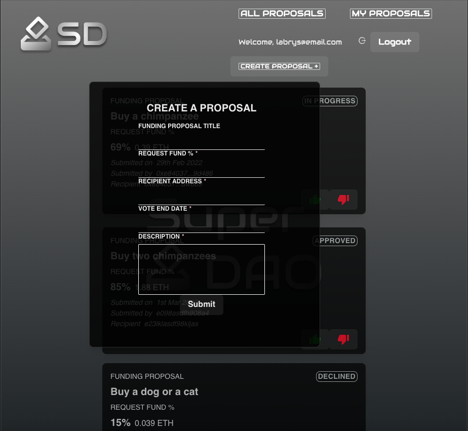
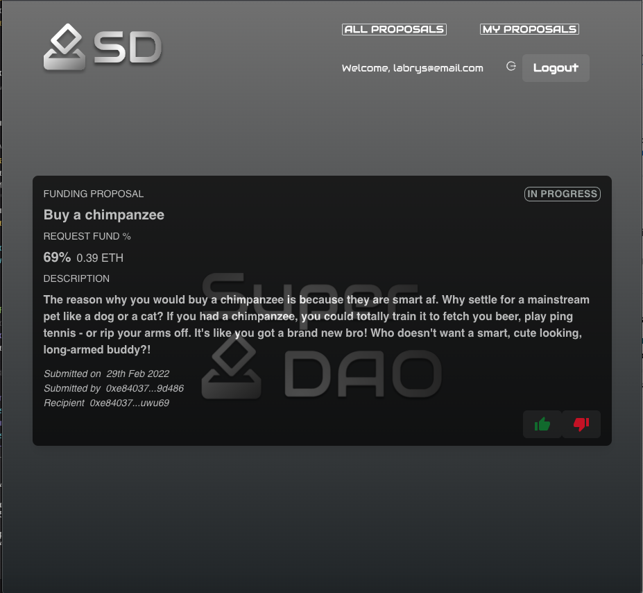

# Intern Project - SuperDAO

## SuperDao

## Description

This was a project that was created while on an internship programme at blockchain services company Labrys. The brief was to build a full stack application using the MERN stack and also integrate a Solidity/MetaMask contract too.

## Visuals

## Homepage

## Login

## All Proposals

## Create Proposal

## My Proposals

## Installation

npm install

## To run application:

## Client

npm start

## Server

npm run dev

## Login (test)

Email: admin@labrys.com
Password: password
